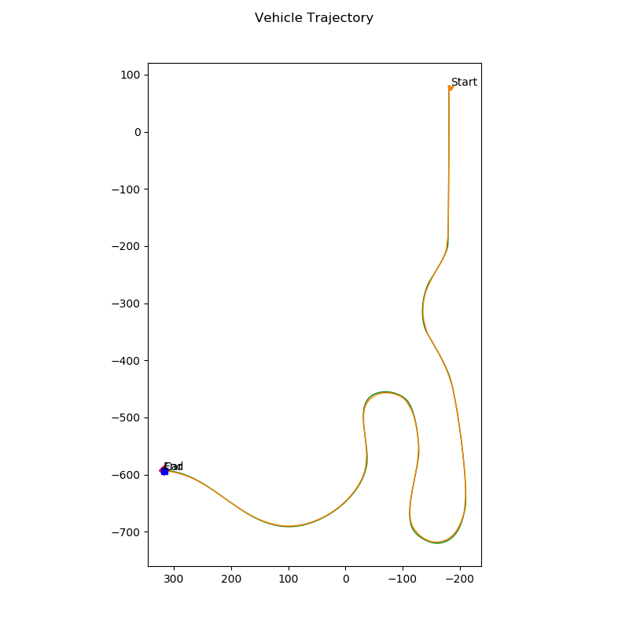

**This program notes help to understand more about the provided software.**

The main code lies in `module_7.py/exec_waypoint_nav_demo`

The process is:

1. Configure, setup and initialize simulation
2. Generate waypoints with interpolation
3. Calculate simulation time step
4. Setup figures
5. Main loop:

    - Get measurements at this step
    - Calculate the closest point on the path
    - Calculate a subset of waypoints (hash table saves each value as the 
    cumulative number of new (interpolated) points at this old point (index))
    - Calculate control input
    - Update figures
    - Send control signals

## Longitudinal Control

I implement PID algorithm for one-level control in `controller2d.py`

- Control parameters (Kp, Ki, Kd)
- Input is desired velocity and current velocity
- Output is throttle value

I want to implement feedforward controller but I did not have the engine dynamics.

## Lateral Control

1. Stanley controller
- Control paramenters (k, k_d)
- Find the closest track point, closest distance => cross-track error (with correct sign)
- Note to use arctan2 and clamp some angles into -pi to +pi
2. Pure Pursuit controller
- Control parameters (none)
- L = 3 meters (I do think so)
- "alpha = yaw - yaw_l_d" is the most important step

The hardest part is to determine correct sign of signals.

